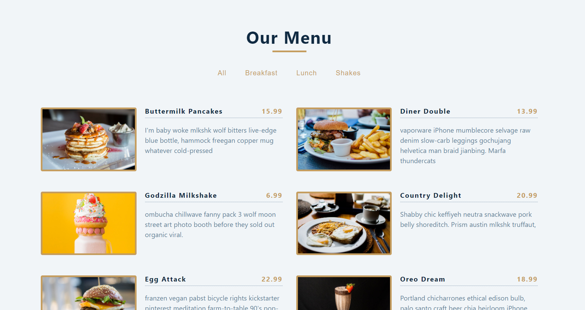
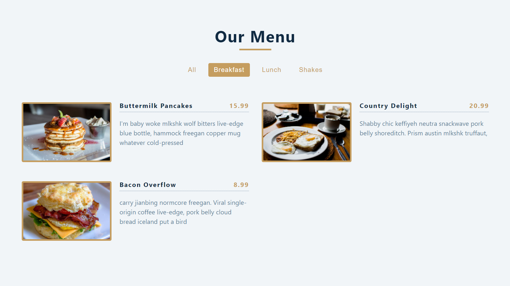

# Menu React Project

---

## Description

- Data is taken from Data.js folder and is destructured to display title, price, image and description.
- All the dishes are categorised according to category.
- Categories are determined according to data and are written on the category bar.
- If new categories are added in the data folder, then new categories will be added automatically on the category bar.
- Each category lists down the dishes under that category.
  
---